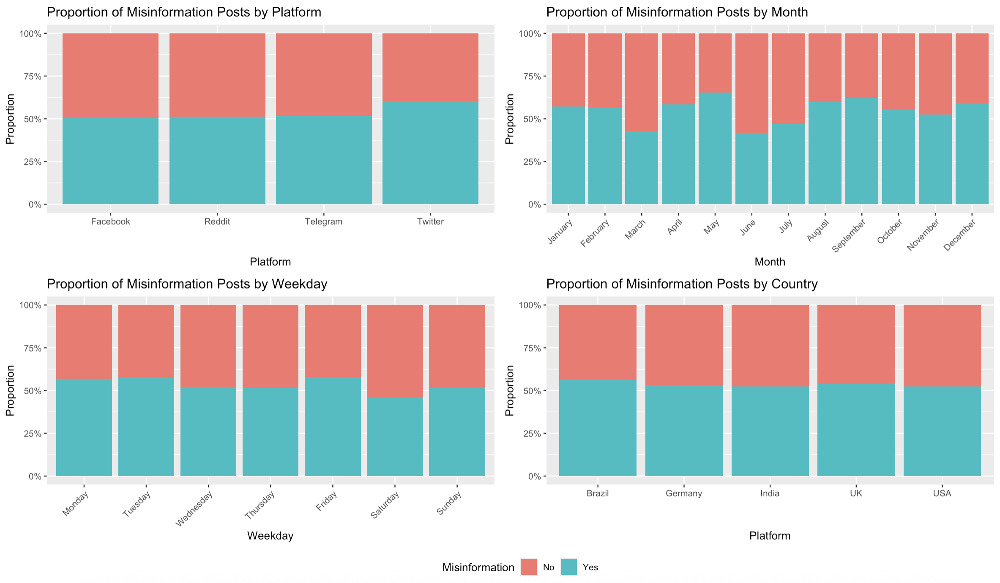
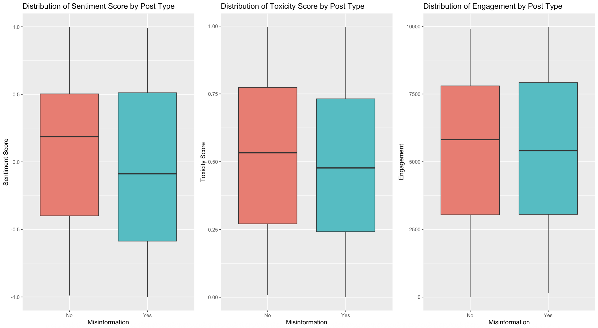

# 🔍 Misinformation Detection using Machine Learning

This project showcases three classical machine learning models trained in R to predict the occurrence of online misinformation. 

---

## Exploratory Data Analysis

An initial exploration of the dataset provides a clearer understanding of its structure and key trends.

**Proportion of Misinformation Across Platforms, Months, Weekdays and Countries**

Overall, misinformation and non-misinformation posts are roughly evenly distributed across platforms, months, weekdays, and countries. Twitter, May, Friday, and Brazil show slightly higher proportions. The roughly 50% share across these factors suggests that misinformation is widespread and that these variables alone may not strongly predict it.

 

**Distribution of Sentiment, Toxicity, and Engagement Across Posts**

Examining sentiment, toxicity, and engagement highlights differences between misinformation and non-misinformation posts. Non-misinformation posts generally have more positive language (median sentiment > 0), while misinformation posts tend to be more negative. Surprisingly, non-misinformation posts show slightly higher toxicity. Engagement levels are similar across both, with non-misinformation posts having a slightly higher median.

---

## Machine Learning Models

After the exploratory data analysis, the dataset was cleaned by recoding data types and removing unused columns. A 70/30 train test split was done and the three models were trained and evaluated on the test set.

| Model                              | Model Complexity          | Accuracy      |
|------------------------------------|---------------------------|---------------|
| Logistic Regression                | 38 X Variables            | 88.0%         |
| Classification and Regression Tree | 4 Terminal Nodes          | 92.7%         |
| Random Forest                      | 500 Trees & RSF Size 4    | 93.3%         |

Overall, the Random Forest model achieved the highest accuracy for this dataset and predictor variables, with the CART model performing similarly. Logistic Regression had the lowest accuracy and comparatively higher error, though it still provided reasonable predictive performance.

 

**Logistic Regression Results**
|                    | Reference: No        | Reference: Yes      |
|--------------------|----------------------|---------------------|
| **Prediction: No** | 60 (True Negatives)  | 8 (False Negatives) |
| **Prediction: Yes**| 10 (False Positives) | 72 (True Positives) |

The logistic regression model has a false positive rate of 14.3% and a false negative rate of 10.0%.

 

**Classification and Regression Tree Results**
|                    | Reference: No        | Reference: Yes      |
|--------------------|----------------------|---------------------|
| **Prediction: No** | 59 (True Negatives)  | 0 (False Negatives) |
| **Prediction: Yes**| 11 (False Positives) | 80 (True Positives) |

The CART model has a false positive rate of 15.7% and a false negative rate of 0.0%.

 

**Random Forest Results**
|                    | Reference: No        | Reference: Yes      |
|--------------------|----------------------|---------------------|
| **Prediction: No** | 61 (True Negatives)  | 1 (False Negatives) |
| **Prediction: Yes**| 9 (False Positives)  | 79 (True Positives) |

The random forest model has a false positive rate of 12.9% and a false negative rate of 1.25%.

